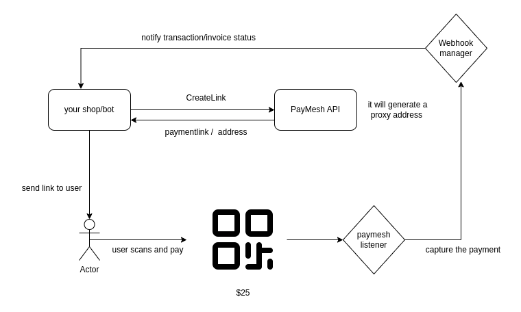

# PayMesh

PayMesh is an open-source Django-based payment gateway that provides an easy-to-use API service. Simply connect your Metamask wallet and start accepting crypto payments on your e-commerce sites, Telegram bots, etc.

Here is the technical architecture diagram:


### Quick explaination

a unique proxy wallet address is automatically generated and associated with each new invoice (payment link) created. This proxy wallet address serves as an intermediary address for the payment transaction and is tracked by django

## Note (Disclaimer)

This is not a decentralized payment gateway by any means. It was developed as a side project for my personal use case of accepting crypto payments. If you are interested in a decentralized version, you can find it [here](https://github.com/ManaanAnsari/PayMesh-Web3).

## Live

You can use this project at [paymesh.xyz](https://paymesh.xyz/). Alternatively, you can self-host it by following the instructions given below.

## Installation

Please install [Redis](https://redis.io/docs/getting-started/installation/) as we will need it for Django Celery.

### Clone the Repository

```bash
git clone https://github.com/ManaanAnsari/PayMesh-crypto-paymentgateway
cd PayMesh-crypto-paymentgateway
```

### Set Up Virtual Environment (optional)

```bash
python -m venv myenv
source myenv/bin/activate
```

### Install Dependencies

```bash
pip install -r requirements.txt
```

### Configure Environment Variables

Create a `.env` file in the project root directory and specify the variables using the `.env_template` file as a template.

### Database Setup

```bash
python manage.py migrate
```

### Run the Application

```bash
python manage.py runserver
```

The application will be accessible at [http://localhost:8000/](http://localhost:8000/).

The Swagger UI will be available at [http://localhost:8000/api/v1/](http://localhost:8000/api/v1/).

### Start Celery Worker and Beat

Open a new terminal for the worker:

```bash
celery -A backend.celery worker --loglevel=info
```

Open a new terminal for the beat:

```bash
celery -A backend.celery beat --loglevel=debug
```

## Contributing

Contributions are welcome! If you'd like to contribute to PayMesh, please follow these steps:

1. Fork the repository.
2. Create a new branch for your feature or bug fix.
3. Make your changes and ensure they are properly tested.
4. Submit a pull request detailing your changes and a description of what they address or fix.

## Todos

- [x] Invoice management
- [x] Payouts
- [x] Refunds
- [x] Webhook support
- [ ] API key access management
